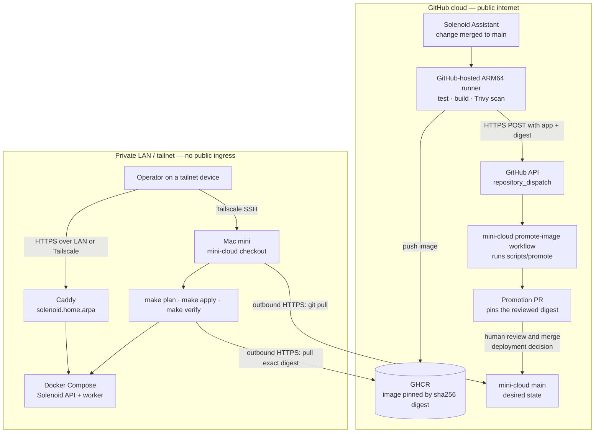

# mini-cloud deployment network flow

mini-cloud does not need public ingress for this deployment flow. The
`repository_dispatch` request is sent by a GitHub-hosted runner to GitHub's API,
and the receiving workflow also runs in GitHub. Nothing in that exchange calls
the Mac mini or crosses the tailnet boundary.

## Network boundary

There is deliberately no arrow from a GitHub runner into the Mac mini:

- The build runner calls `api.github.com/repos/elicollinson/mini-cloud/dispatches`.
  That endpoint creates a GitHub event; it is not a webhook delivered to the
  appliance.
- The promotion workflow edits the mini-cloud repository and opens a PR entirely
  within GitHub.
- Merging the PR records the deploy decision, but does not contact or mutate the
  running appliance.
- An operator reaches the Mac mini over Tailscale SSH and runs `git pull` plus
  `make apply`. The appliance only needs outbound HTTPS access to fetch Git state
  and pull the image from GHCR.
- Browser traffic reaches `solenoid.home.arpa` only from the LAN or tailnet,
  through Caddy. The application has no public GitHub-facing endpoint.

If deployment is automated later, prefer an outbound-polling agent or a
self-hosted runner that initiates its connection to GitHub. Exposing a public
webhook on the appliance is unnecessary and would change mini-cloud's current
trust boundary.

## GitHub references

- [Events that trigger workflows: `repository_dispatch`](https://docs.github.com/en/actions/reference/workflows-and-actions/events-that-trigger-workflows#repository_dispatch)
- [REST API: create a repository dispatch event](https://docs.github.com/en/rest/repos/repos#create-a-repository-dispatch-event)
- [Communication requirements for self-hosted runners](https://docs.github.com/en/actions/reference/runners/self-hosted-runners#requirements-for-communication-with-github)
